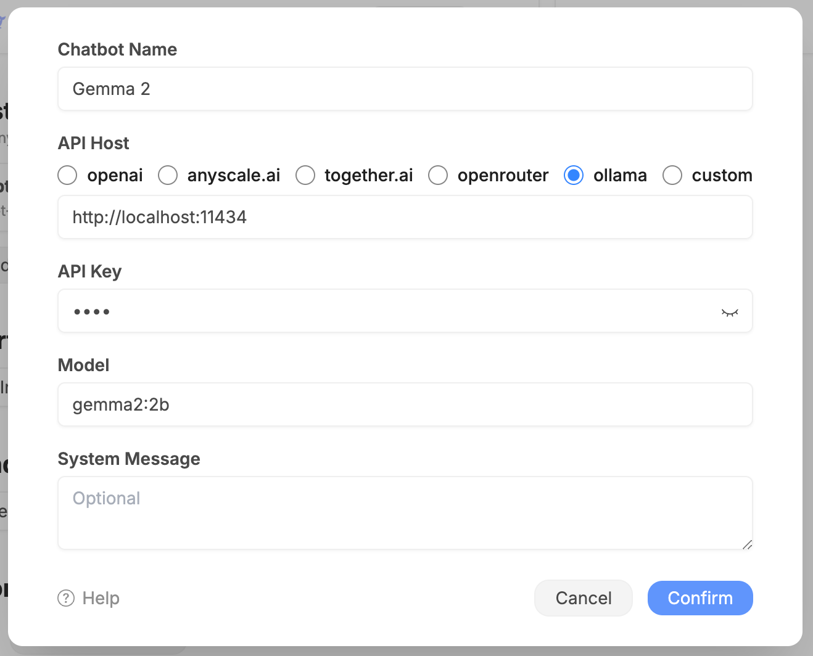

[Ollama](https://github.com/ollama/ollama) allows you to run open-source large language models, such as Llama 3, locally.

## Preparation

Install Ollama and download models.

## Configuration

We're using the `gemma2` model in this example.

API Key is required but ignored, so you can input any string.
