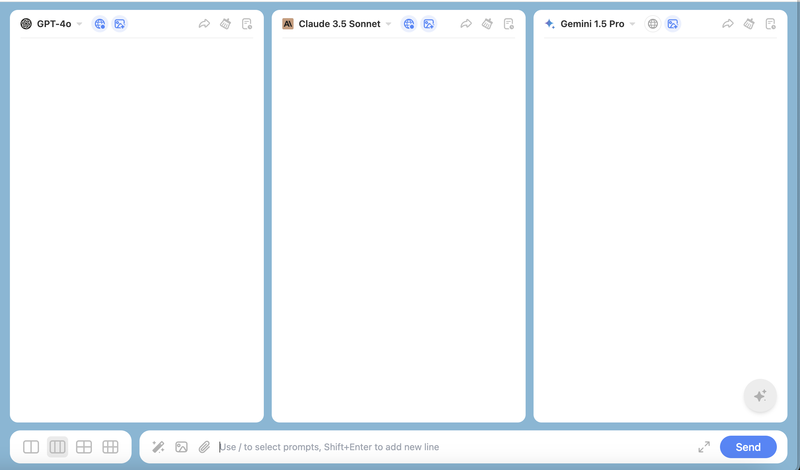

ChatHub's standout feature is its ability to let you use multiple large language models at the same time. With just a single input, you can receive responses from various models, offering you a broader range of possibilities and insights across different scenarios

You can choose different large language models and quantities based on your needs, and you can chat with up to six large language models simultaneously.

