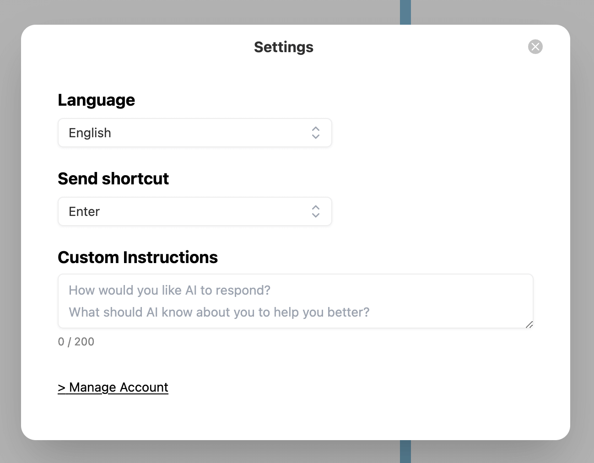

The Custom Instructions feature in ChatHub allows users to personalize how the AI interacts with them. By providing specific details about yourself and your preferences, you can tailor the AI's responses to better suit your needs. This feature is designed to make your experience more engaging, relevant, and enjoyable.

## How to set Custom Instructions

1. Go to the ChatHub Settings.
2. Fill in the Custom Instructions field with your instructions.

3. Click on the "Save" button.

## Examples

Here are some examples of custom instructions you can use:

#### Personal Information
- "My name is John, and I'm a frontend developer"
- "I'm a computer science student"
- "I work as a product manager in the AI industry"

#### Response Style Preferences
- "Please keep your responses concise and to the point"
- "I prefer casual and friendly conversations"
- "Use simple language and avoid technical jargon"
- "Feel free to add emojis and be more playful in your responses"

#### Specific Requirements
- "Always include code examples when explaining programming concepts"
- "Please explain things as if you're teaching a beginner"
- "Include relevant resources or documentation links in your responses"