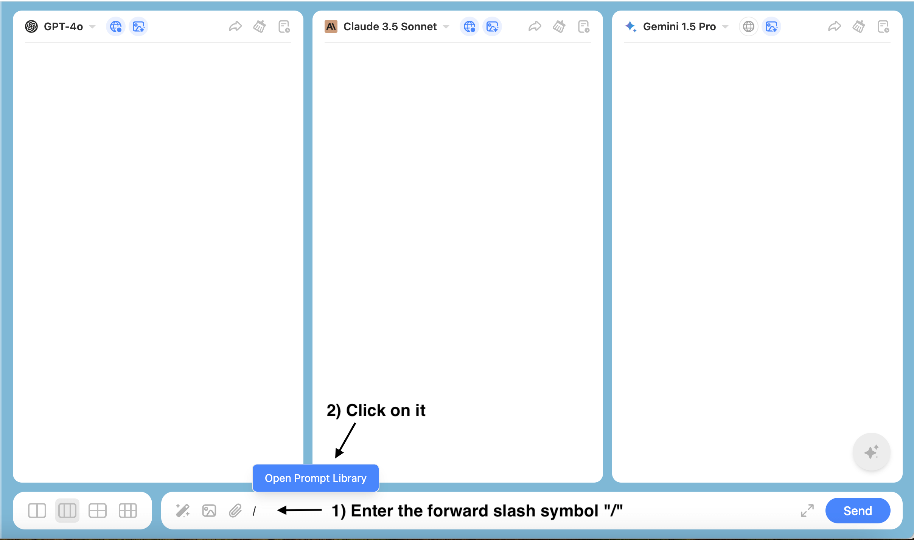

ChatHub offers a Prompt Library service where you can customize prompts according to your needs and preferences, saving and managing them in the Prompt Library for quick access. You can also select the prompts you need from the prompt community, helping you apply more suitable prompts in different scenarios, thereby increasing efficiency.

To access this service, you can either type a forward slash (/) in the chat box or click this icon：

OR

You can create your own prompts based on your needs.

Or choose the prompts you want to use from the prompt community.

