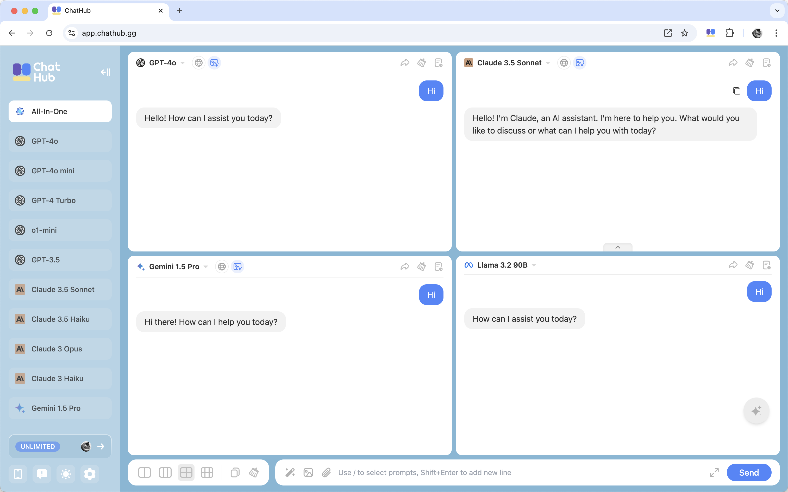

## Main Features

- Use multiple AI chatbots [side by side](/features/chat-simultaneously)
- Supports a wide range of [AI models](/cloud/index), including GPT-4o, Claude 3.5, Gemini, and more
- Chat with [PDF](/premium-features/file-upload) and [images](/features/image-upload)
- [Generate images](/cloud/image-generation) with FLUX.1
- Access latest information from the internet with [Web Access](/premium-features/web-access)
- Manage prompts with [Prompt Library](/features/prompt-library)

## Get Started with ChatHub

The easiest way to get started with ChatHub is to use the web app. You can access it at [**app.chathub.gg**](https://app.chathub.gg/?utm_source=doc).

