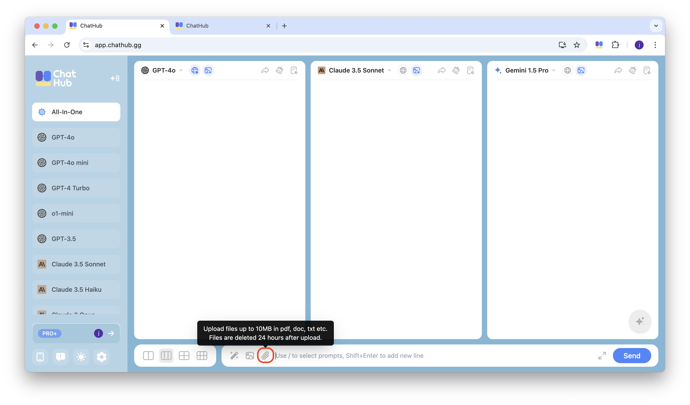
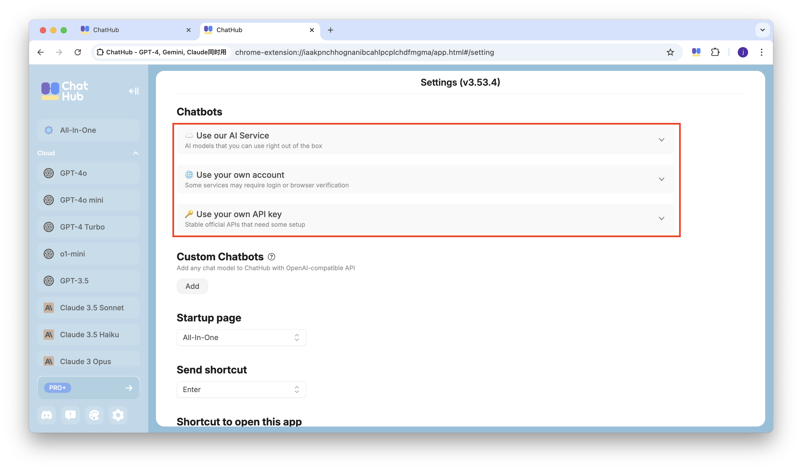
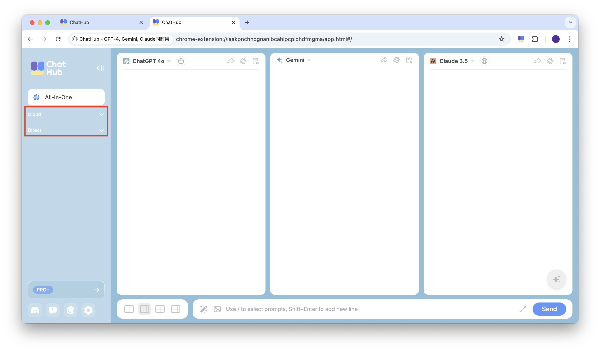

ChatHub is an all-in-one AI client that allows you to use multiple AI chatbots side by side. It supports a wide range of AI models, including ChatGPT/GPT-4o, Claude 3.5, Gemini, Llama, and more. With a single input, ChatHub allows you to receive responses from up to six AI chatbots at once.

## Web App

The easiest way to get started with ChatHub is to use the web app. You can access it at [**app.chathub.gg**](https://app.chathub.gg/?utm_source=doc).

Compared to browser extensions, the web app version supports uploading files in multiple formats：

## Browser Extension

The browser extension is suitable for users who want to use their own API key. You can install it from the [**Chrome Web Store**](https://chathub.gg/chrome).

In the browser extension, we offer you three options: use our AI service, use your own account, or use your own API Key：

You can select the service you need from the left sidebar：

## Mobile Apps

The iOS and Android apps are available on the App Store and Google Play. You can get them from [https://chathub.gg/download.](https://chathub.gg/download.\))

The App version allows you to use different large language models anytime, anywhere.

