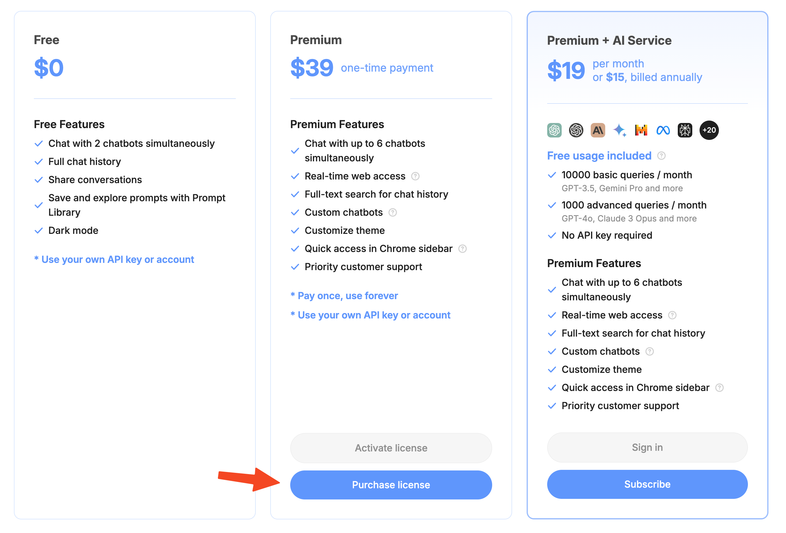
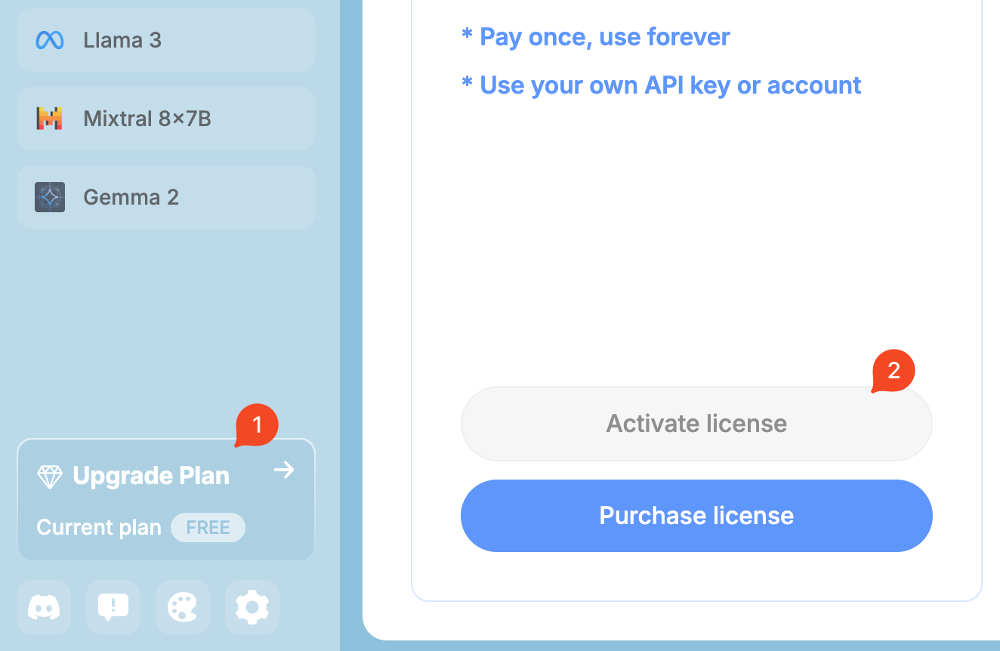

The Lifetime Premium plan offers users access to all premium features for a lifetime. After one-time payment, you will receive a license key to activate the app.

<Warning>Lifetime Premium only works for the ChatHub browser extension and cannot be activated on the ChatHub Webapp.</Warning>

## How to purchase

You can purchase the lifetime premium from the [ChatHub browser extension](https://chathub.gg/chrome).

## How to activate the license

After receiving the license key, you can activate the license from the [ChatHub browser extension](https://chathub.gg/chrome).

## What happens if I want to switch the device or browser associated with my lifetime membership?

If you wish to use your lifetime membership on a different device or browser, you can deactivate it on one device and then reactivate it on another. This process allows you to transfer your membership between devices as needed.

## Is there a limit to how many times I can deactivate and reactivate my lifetime membership?

No, there is no limit to the number of times you can deactivate and reactivate your membership. However, keep in mind that you can only have your membership active on the number of browsers corresponding to your purchased pricing tier at any given time.

## How can I upgrade my lifetime membership to a higher tier?

If you wish to upgrade your membership to a higher tier (e.g., from 1 browser to 3 browsers), please contact our customer support team. They will be happy to assist you.

## How to manage activations

You can deactivate the current activation in the ChatHub extension.

We also provide a dedicated tool to view and manage all your activations:
https://app.chathub.gg/license-manager