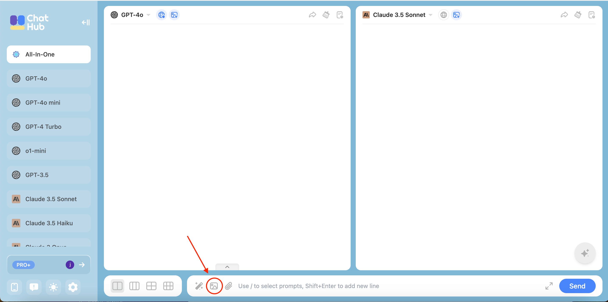
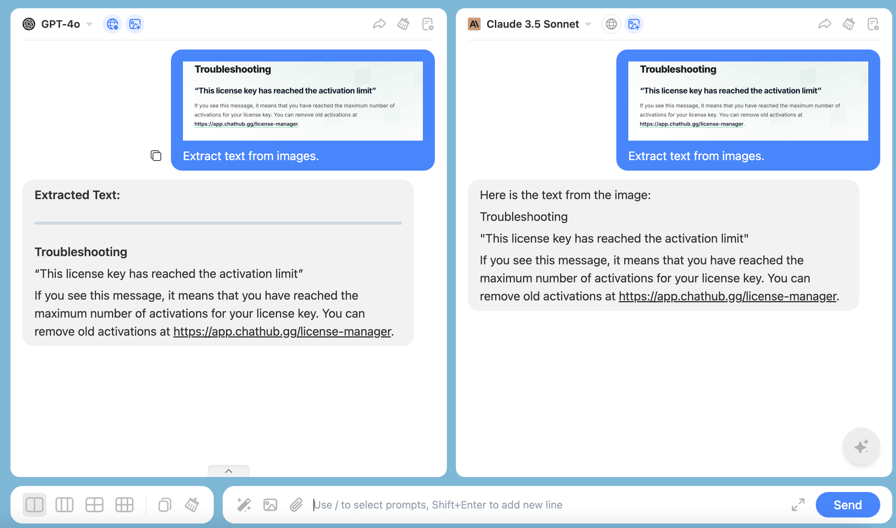
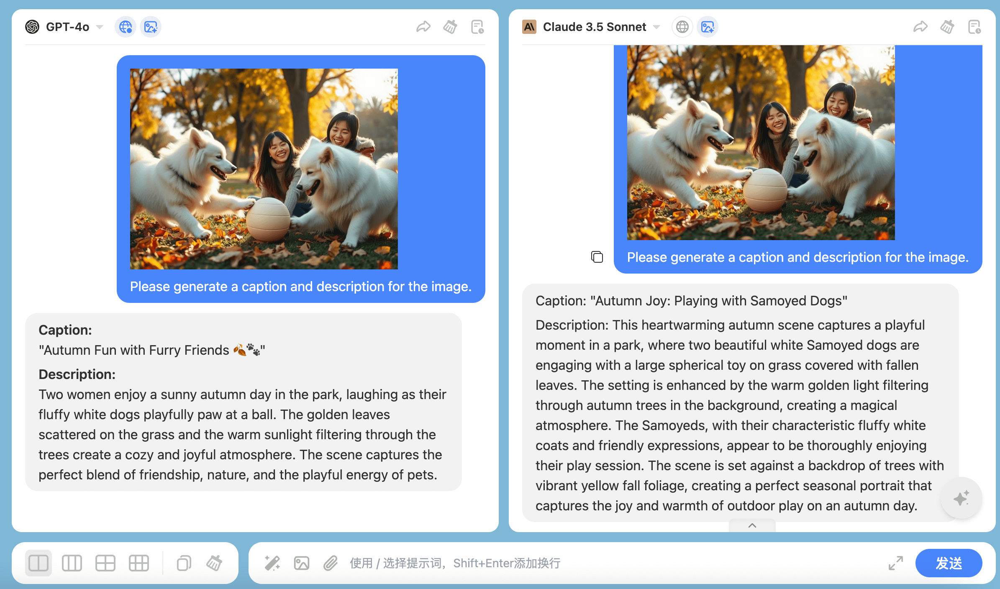
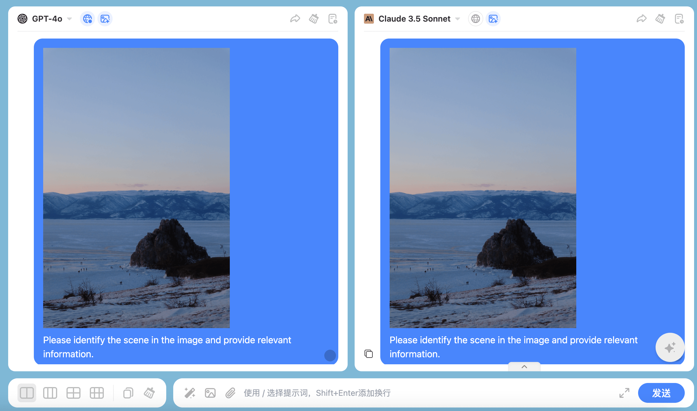
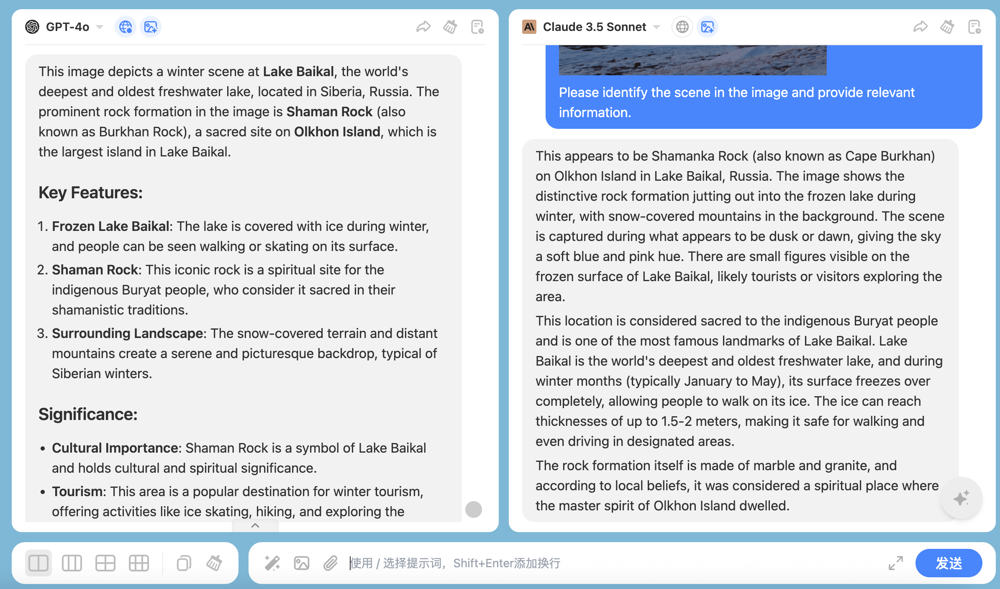
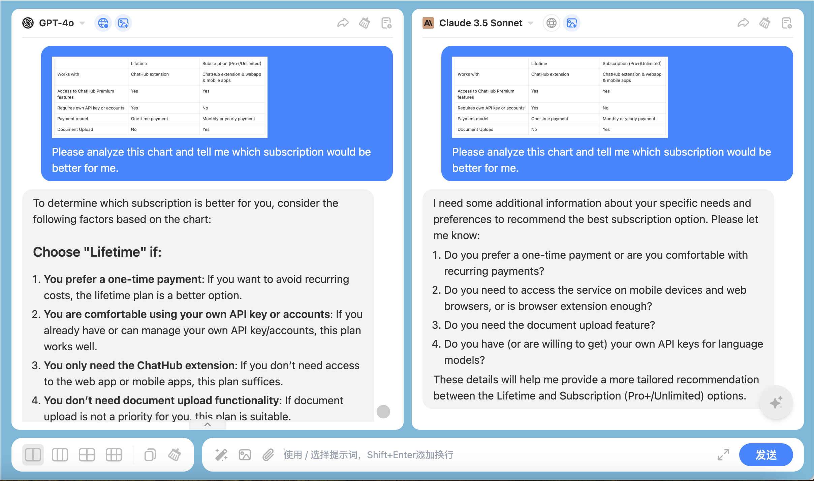

When the model you select supports image recognition, you can upload images during your interaction with the model. This enables a wide range of functionalities, from content recognition to generation, and from data extraction to creative assistance, providing you with smarter and more efficient services.

## **What can you do with the image upload feature?**

Here are some examples for you.

### **Text Extraction (OCR)**

You can upload photos, screenshots, etc., to quickly extract text from images.

### **Image Description**

Generate captions or descriptions for images.

### Visual Analysis

Analyze and interpret visual data, such as identifying objects, scenes, or people.

### Chart/Graph/Diagram Analysis

