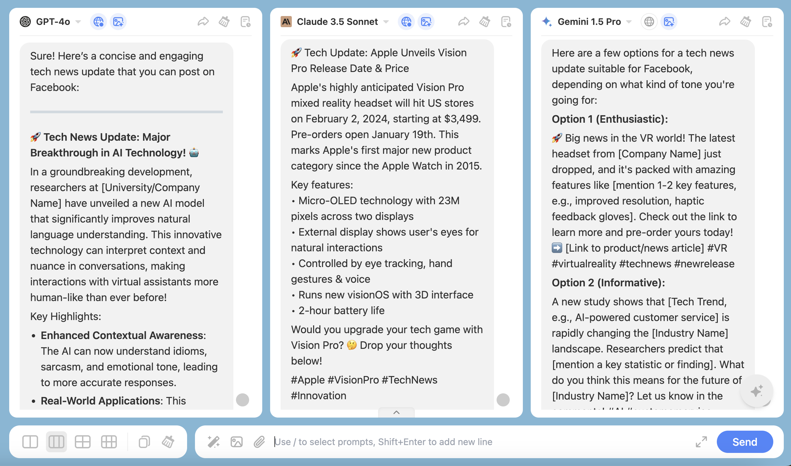

We will provide you with some examples, and you can modify or refine the prompts according to your specific needs to achieve better results.

## Text Creator:

### **1. Creative Generation and Brainstorming**

When you need to create articles, novels, scripts, or advertising copy, you can have the model provide creative ideas. It can offer storylines, character settings, dialogue inspiration, or suggestions for article titles, paragraph openings, or conclusions.

**Example**: Input “Help me design a plot for a short story about artificial intelligence.”

### **2. Copywriting and Optimization**

You can have the model generate a draft based on your needs, saving you time. You can also input your text into the model and ask it to optimize sentences, adjust tone, or enhance readability. Additionally, it can generate copy in different styles or tones for easier selection.

**Example**: Input “Help me write an article on ‘how to improve work efficiency’ with a word limit of 1000 words.”

### **3. Editing and Proofreading**

Use the large language model for grammar checks, including spelling, grammar, and punctuation errors. Have the model analyze the logical structure of your article and provide suggestions for improvement. You can also adjust the language style based on the target audience (e.g., academic, casual, humorous).

**Example**: Input “Help me check if the grammar and logic of this text are coherent.”

### **4. Data and Information Organization**

You can quickly find information through ChatHub, allowing the model to provide background information or data on a specific topic, as well as summarize long articles or reports into concise points.

**Example**: Input “List five key facts about ‘climate change.’”

### **5. Translation and Multilingual Creation**

You can translate text into multiple languages while maintaining semantics and style, and adjust content expression based on different cultural backgrounds.

**Example**: Input “Help me write a travel advertisement in Chinese.”

### **6. Learning and Skill Enhancement**

You can ask the model for writing tips or style suggestions, or have it mimic the style of a particular author to help you learn and draw inspiration.

**Example**: Input “Write a passage in the style of Haruki Murakami.”

### **7. Time Management and Work Planning**

You can break down complex writing tasks into actionable steps, or generate a writing plan based on your goals and schedule.

**Example**: Input “Break down ‘writing a long article about artificial intelligence’ into several steps.”

### **8. Social Media and Marketing Support**

You can generate content suitable for different platforms using the model. You can also perform SEO optimization, generating articles or titles that include keywords to improve search engine rankings.

**Example**: Input “Help me write a tech news update suitable for posting on Facebook.”

### **9. Creative Writing and Experimental Content**

You can attempt to generate poetry, lyrics, or other forms of creative writing, as well as explore novel narrative styles or structures.

**Example**: Input “Help me write a modern poem about autumn.”

### **10. Collaboration and Cooperation**

You can view the model as a writing partner, discussing ideas or modifying content at any time.

**Example**: Input “I have a story opening; how should I develop it next?”

## Video Creators

If you are a video creator, in addition to the aforementioned uses, you can also utilize ChatHub to assist you in the following ways:

### **1. Script Writing**

You can have the model generate a first draft of a video script based on a theme or concept, saving you time.

Example: Input “Help me write a short video script about German cuisine.”

### **2. Creative Ideation and Brainstorming**

You can use the model for creative brainstorming to get different ideas, asking for suggestions on video themes, styles, or formats.

Example: Input “Give me some suggestions on how to create a travel-themed creative video, providing three different styles.”

### **3. Content Optimization**

You can input existing scripts into the model and ask it to optimize the language, adjust the tone, or enhance readability, or generate catchy video titles and descriptions to improve viewer engagement.

Example: Input “Generate an engaging title and a brief description for my video.”

You can describe the specific content of your video to the large model based on your specific situation, and try to be as detailed as possible so that you can get better answers.

### **4. Learning and Skill Enhancement**

You can have the model mimic the style of a well-known creator to help you learn and draw inspiration.

Example: Input “Write a video script in the style of a specific YouTuber.”

