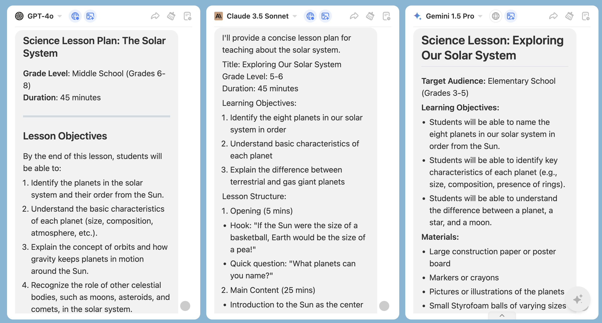
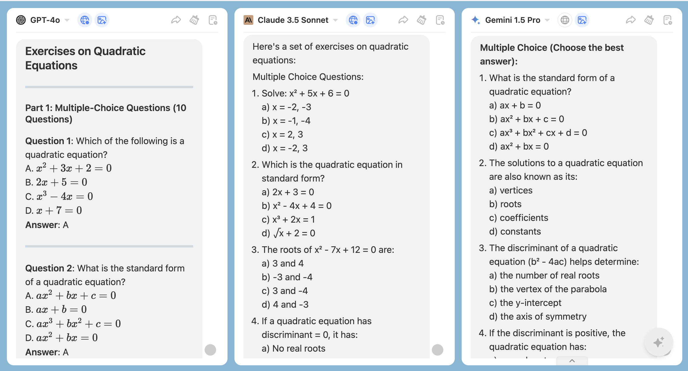

ChatHub is perfect for educators.

We will provide you with some examples, and you can modify or refine the prompts according to your specific needs to achieve better results.

### **1. Quickly Generate Teaching Content**

Simply input a topic, and the AI tool can generate various versions of teaching materials for you, such as course outlines, handouts, PPT content, exercises, and answers. In ChatHub, you can receive responses from different large language models simultaneously, allowing you to choose the most suitable content and save a significant amount of time.

**Example**: Input “Design a science lesson about the solar system.”

By comparing and summarizing, you can select the information you need more quickly and accurately.

|                                      |                       |
| :----------------------------------------------------: | :----------------------------------------------------: |
|  |  |

**Example**: Input “Create a set of exercises on quadratic equations, including 10 multiple-choice questions and 5 open-ended questions.”

### **2. Provide Personalized Learning Support**

The tool can help you offer personalized learning suggestions and resource recommendations for students. Whether it’s answering their questions or designing tailored learning plans, ChatHub can respond quickly and provide diverse solutions from different models, which you can adjust based on the student’s actual needs.

**Example**: Input “Design a learning plan for a student with weak math fundamentals.”

### **3. Design Innovative Classroom Activities**

The tool can provide creative classroom activity ideas, such as role-playing, debate topics, or project-based learning tasks. By leveraging responses from different models, you can gain inspiration and easily create engaging and effective classroom activities.

**Example**: Input “Design a classroom activity about environmental protection.”

### **4. Offer Teaching Inspiration**

When you’re lacking inspiration, you can turn to ChatHub for help. Different models will provide diverse responses, allowing you to easily gather new ideas.

**Example**: Input “Suggest some teaching methods to make middle school students more interested in history.”

### **5. Efficiently Grade Assignments and Assessments**

The tool can assist you in quickly grading student essays and short-answer questions while providing detailed feedback. By comparing responses from different models, you can receive multi-perspective evaluation suggestions, making your feedback more comprehensive and targeted.

**Example**: Using the image upload feature, input “Please review this essay and provide some suggestions for improvement.”

### **6. Support Your Professional Development**

ChatHub not only helps you complete teaching tasks but also supports your professional growth. Whether it’s finding educational research materials, drafting research papers, or learning new teaching methods, ChatHub can provide diverse references for you.

**Example**: Input “Write a research report on trends in online education.

