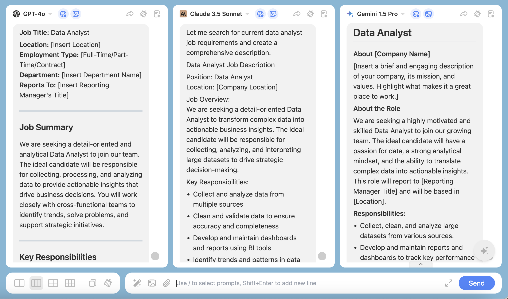
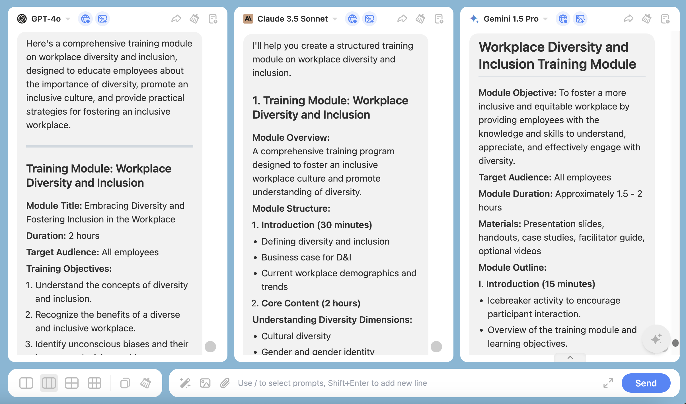
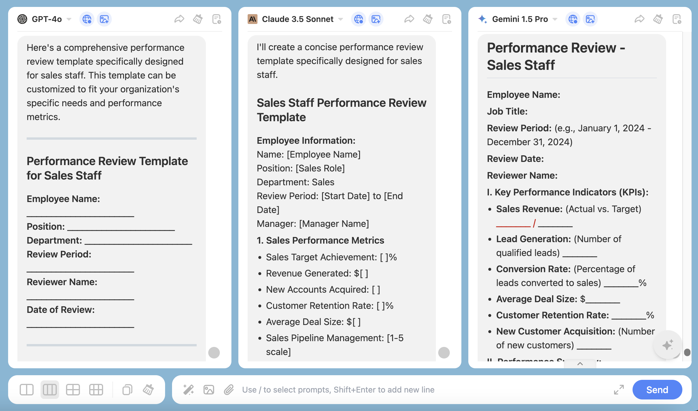
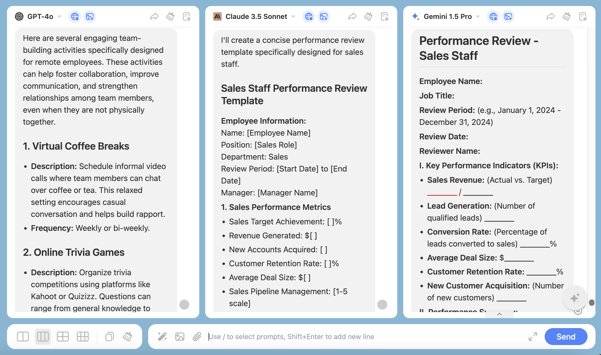
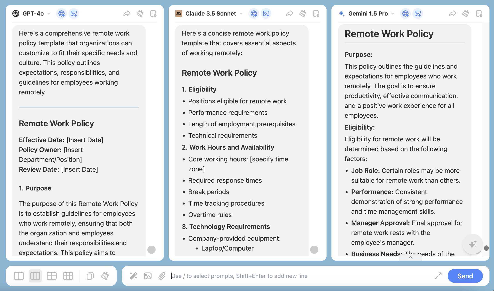
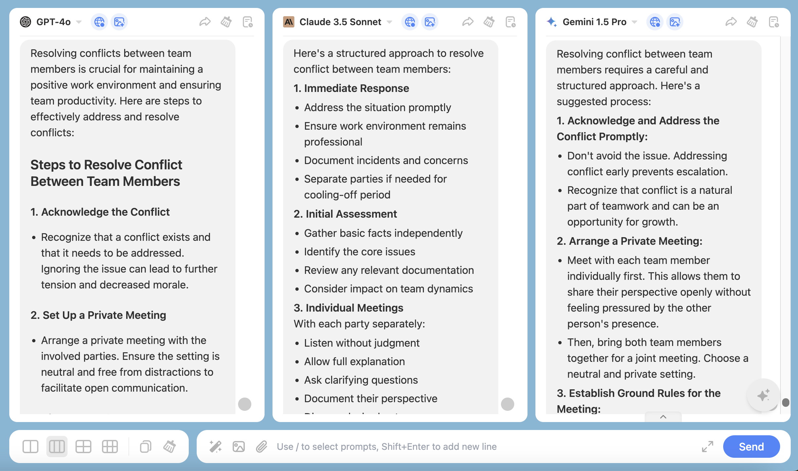

We will provide you with some examples, and you can modify or refine the prompts according to your specific needs to achieve better results.

### **1. Streamline Recruitment Processes**

You can use ChatHub to make your recruitment process smoother and more efficient. By generating job descriptions, screening questions, and interview guides.

**Example**: Input “Create a job description for a Data Analyst position.”

### **2. Generate Training Content**

Leverage ChatHub to create training materials that meet specific employee needs or align with your company policies.

**Example**: Input “Develop a training module on workplace diversity and inclusion.”

### **3. Create Performance Review Templates**

You can use ChatHub to design performance review templates that ensure comprehensive evaluations of employee performance, aligning with your company goals.

**Example**: Input “Create a performance review template for sales staff.”

### **4. Develop Employee Engagement Initiatives**

ChatHub can help you brainstorm and plan employee engagement activities that foster a positive workplace culture.

**Example**: Input “Suggest team-building activities for remote employees.”

### **5. Support Policy Development**

You can utilize ChatHub to draft and refine company policies, ensuring they are clear, comprehensive, and compliant with legal standards.

**Example**: Input “Draft a remote work policy for employees.”

### **6. Facilitate Conflict Resolution**

ChatHub can offer strategies and communication templates for resolving workplace conflicts, helping you mediate effectively.

**Example**: Input “Suggest steps to resolve a conflict between two team members.”

