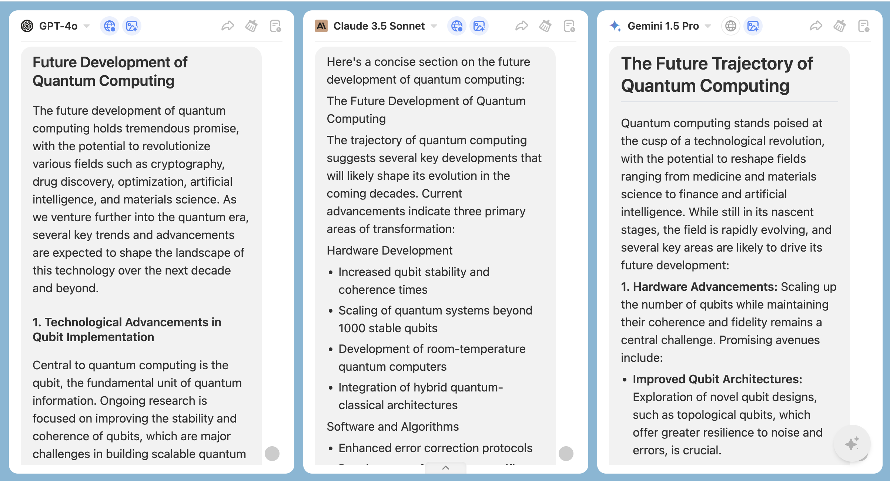

ChatHub is perfect for researchers.

We will provide you with some examples, and you can modify or refine the prompts according to your specific needs to achieve better results.

### **1. Literature Review and Information Retrieval**

Quickly access the current state and trends of research in a specific field and generate a draft of a literature review.

**Example**: Input "Please summarize the main research advancements in 'the application of deep learning in medical imaging.'"

### **2. Research Design and Methodology**

Provide suggestions for experimental design or survey methods based on research questions, and explain complex research methods or statistical analysis techniques.

**Example**: Input "I want to study 'the impact of social media on adolescent mental health.' How should I design the experiment?"

### **3. Data Analysis and Processing**

Offer steps and code examples for data analysis, assist with statistical software (e.g., R, Python, SPSS), or help interpret data analysis results and provide possible conclusions and discussions.

**Example**: Input "How can I perform linear regression analysis using Python? Please provide a code example."

### **4. Academic Writing and Editing**

Generate drafts or sections of a paper based on the research topic. Additionally, optimize the language of the paper, and check for grammatical and logical errors.

**Example**: Input "Help me write a section of a paper on 'the future development of quantum computing.'"

### **5. Conference Preparation and Presentations**

Assist in preparing academic reports or presentation scripts, ensuring the content is clear and logical, or generate key points and explanations for slides based on the research content.

**Example**: Input "Help me write the opening of an academic report on 'ethical issues in artificial intelligence' and generate a corresponding PPT outline."

### **6. Creativity and Inspiration**

Provide creative suggestions for research questions, hypotheses, or experimental designs, and offer new perspectives and ideas by integrating knowledge from different disciplines.

**Example**: Input "How can psychology and data science be combined to conduct a new study?"

### **7. Learning and Skill Development**

Provide resources and suggestions for learning new skills or tools.

**Example**: Input "Recommend some online courses or books for learning machine learning."

