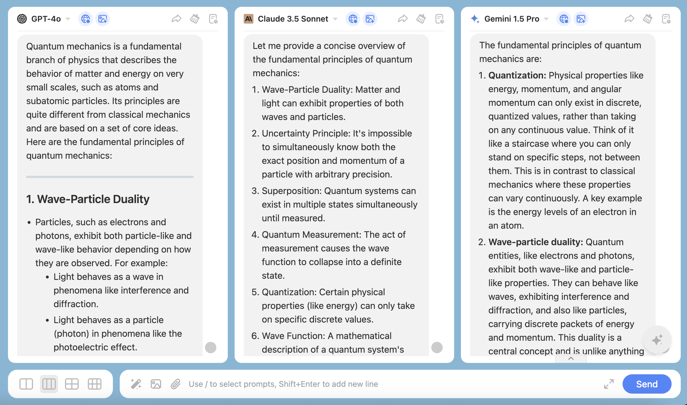
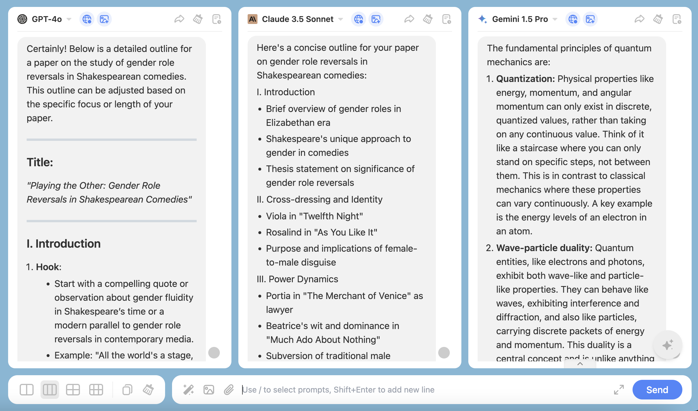
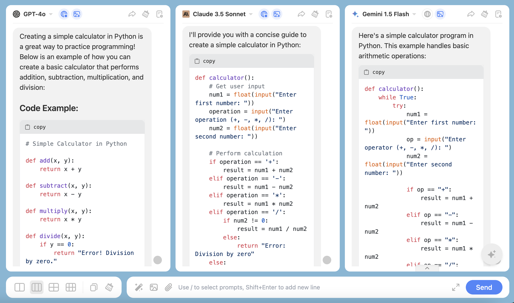
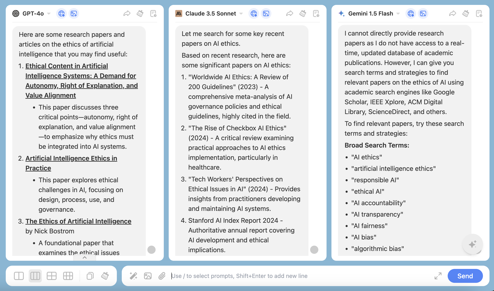
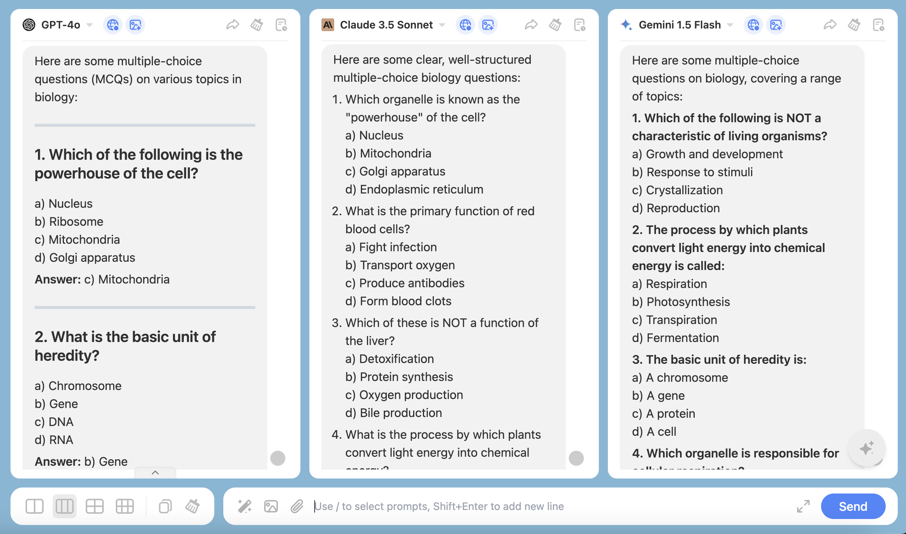
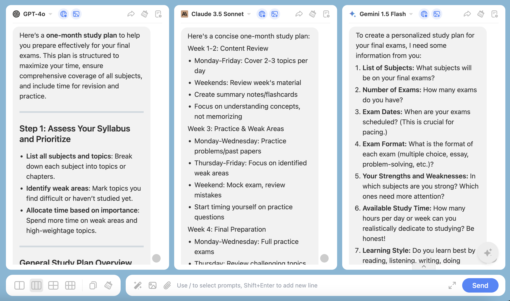

ChatHub is perfect for students.

<Note>
💡 Large language models are tools to aid understanding and learning, not shortcuts to replace thinking and learning. It is recommended to combine them with traditional learning methods to achieve the best learning outcomes.
</Note>

We will provide you with some examples, and you can modify or refine the prompts according to your specific needs to achieve better results.

### 1. **Learning Assistance**

You can ask the AI tool questions to get explanations of complex concepts. The model can provide concise explanations and relevant examples to help you understand.

**Example:** "What are the fundamental principles of quantum mechanics?"

### 2. **Writing Support**

When writing essays or reports, you can use the AI tool to generate outlines or provide writing suggestions to help you organize your thoughts.

**Example:** "Help me create an outline for a paper on the study of gender role reversals in Shakespearean comedies."

### 3. **Programming Assistance**

While learning programming, you can ask the AI tool for code examples or debugging advice.

**Example:** "How can I create a simple calculator using Python?"

### 4. **Language Learning**

You can use the AI tool for language practice, such as conversational practice or writing exercises.

**Example:** "How do I introduce myself in French?"

### 5. **Research Support**

When conducting academic research, you can use the AI tool to find relevant literature or get background information on research topics.

**Example:** "Recommend some research papers on the ethics of artificial intelligence."

### 6. **Review and Test Preparation**

You can use the AI tool to generate review materials or mock test questions to help you study and prepare.

**Example:** "Generate some multiple-choice questions on biology for me."

### 7. **Time Management and Study Planning**

You can ask the AI tool to help you create study plans or time management strategies.

**Example:** "I have one month to prepare for my final exams. Help me create a study plan."

